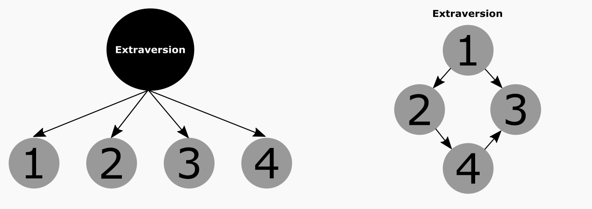

```{r include = FALSE}
libs <- c("papaja", "psych", "RCurl", "tidyverse", "lavaan", "stringr", "careless", "corrr", "qgraph", "mgm", "bootnet", "knitr", "kableExtra")

lapply(libs, require, character.only = T)

#Note: to access the Google Doc version of this manuscript, see this link: https://docs.google.com/document/d/1it0NpMMMU7aKXdSFGkjxs28XQ5ioiHhGNZY2kC9lTEg/edit
```

# Introduction

Recent findings suggests self-report inventories conform to an ideal point process in which persons endorse items only to the extent the item content reflects the respondent’s level of the attribute, or \(\Theta\). Modeling the correct response process in personality assessment produces several psychometric benefits, such as improved dimensionality, higher total test information, and revelation of curvilinear effects [@drasgow75YearsLikert2010]. One reason for such gains is the ideal point perspective retains items assessing low, intermediate, and high trait values and, thus, creates an instrument providing greater measurement precisions across a broad range of a targeted attribute. 

Due to its methodological nature, ideal-point research has focused largely on technical issues, such as appropriate item writing strategies, model fitting, or validity gains. Surprisingly little work has been done to explore the advantages of ideal-point inventories to understanding personality itself, such as explaining where traits come from, how they operate, and how they produce differences in behavior. These questions lie at the heart of the discipline [@fleesonWholeTraitTheory2015] and carry theoretical implications for understanding why personality predicts work behavior and how personality changes over time (i.e., selection and development). Given that ideal-point inventories capture a wider array of elemental differences in emotions, thoughts, and behaviors constituting the Big Five, they may especially suited to identifying plausible mechanisms through which personality processes (deliberation, emotional regulation) accrue to form traits (individual differences). 

Drawing upon a psychometric network approach to individual differences [@cramerDimensionsNormalPersonality2012], we recast the Big Five as a dynamic system of directly interacting feelings, thoughts, and behaviors. Rather than treat ‘hidden traits’ as causal forces lying behind stable behavioral patterns, the network approach models traits as consequences of mutually reinforcing interactions between specific thoughts, feelings, and behaviors (see Figure 1 for illustration). From this perspective, discrete actions like working hard to attain long-term goals, planning one’s week, and focusing on a task to completion in a person high on Conscientiousness do not co-occur because of a top-down latent disposition, but because deciding to care about a long-term goal leads one to be more disciplined in allocation of personal resources. Forces bonding autonomous acts into trait clusters might be shared biological origins, learning principles, socially enforced norms, or functional aims that produce accretion of multiple explanatory mechanisms which unite for causal, homeostatic, or logical reasons [@cramerDimensionsNormalPersonality2012; @fleesonWholeTraitTheory2015; @woodHowFunctionalistProcess2015]. 

```{r, echo = FALSE, fig.width = 8, fig.height = 6, fig.align = "center", fig.cap = "Trait model according to a latent variable (left panel) and a network perspective (right panel)"}

```

More importantly, the network perspective can provide a better view of the cognitive, motivational, and functional dynamics characterizing the development of the personality system, therefore favoring empirical investigations of such mechanisms. Incorporating ideal point items may offer further insight into trait development by pinpointing intermediate ranges of a trait continuum (i.e., nodes) which incrementally ‘bridge’ personality components across distinct clusters [@borsboomNetworkAnalysisIntegrative2013]. For instance, the conscientiousness item ‘I tend to be disorderly but also like to keep certain things tidy’ may bridge the agreeableness item of ‘I don’t like to let others down’ to the remaining network of conscientiousness items. Why? Because development in compassion arising from social roles (e.g., serious relationships, care for family) might elevate conscientiousness by causing individuals to start bringing personal affairs in order. That is, when we begin caring about others we may try to get our ‘act together’ in order to meet social responsibilities. Such effects may be less evident in extreme items (I always keep my affairs in order) because developmental processes are gradual and better seen in intermediate steps. By finding and pulling these functional levers (i.e., intermediate items), we may be able to nudge people to change in productive ways on multiple dimensions (or traits) which has implications for executive coaching and trait interventions. 

The current study unifies these methodological innovations by applying network analyses to a Big Five instrument developed with ideal-point item writing strategies. We contrast four major network properties with research exploring similar properties of common Big Five inventories [@costantiniFrameworkTestingCausality2018; @costantiniStateARtPersonality2015; @cramerDimensionsNormalPersonality2012]. The first is the topology, or *large-scale structure*, of the Big Five including global node arrangement and degree to which nodes cluster together while distances between any two nodes remain small [*small-worldness*; @costantiniStateARtPersonality2015]. Two, we identify the nature and content of cross-trait item pairings to identify possible *bridging* components explaining observed covariance between trait factors (e.g., why do agreeable people tend to be conscientious). Three, we compare the most “central” and “peripheral” nodes with the nature of the central facets identified in past publications. Nodes which are central play a more prominent role in connecting elements of the personality system and, consequentially, may be idea targets for intervention if desiring to shift one’s personality. Finally, given the general importance of emotional stability and conscientiousness for job performance across occupations, we examine the *shortest* pathways that may explain the route through which changes in emotional stability (conscientiousness) may facilitate changes in conscientiousness (emotional stability). In all cases, we highlight areas where ideal-point items play a role in facilitating information flow in the Big Five network. 

# Methods and Results
Given space limits yet novelty of network terminology, the methods and results are presented concurrently. The data for this study come from a sample (n = 677) of working employees from Amazon’s Mechanical Turk (MTurk) who completed a suite of ideal point personality assessments capturing the Big Five Aspects [see @castilleBrightDarkVirtues2015; @deyoungCyberneticBigFive2015]. The marginal reliabilities of these assessments were all acceptable (ρ > .82). Psychometric network analyses [@costantiniStateARtPersonality2015] involved casting items as nodes connected by lines, the strength of which corresponds to the strength of the GLASSO regularized partial correlations linking said nodes. The initial network is presented in Figure 1 (item labels provided in Table 1). 

```{r, echo = FALSE}
#data
require(RCurl)
require(readr)
require(dplyr)
data <- read_csv("Data/data.csv")

#####   Organize Dataset    ##### 
personality <- data[c(69:236)]
names(personality) <- gsub("Here.are.a.number.of.characteristics.that.may.or.may.not.apply.to.you..Please.indicate.the.extent....", "", names(personality), fixed = TRUE)
itemnames <- colnames(personality)[-c(28:30, 59:60, 97:101, 130:131, 163:168)]
itemnames <- gsub(".", " ", itemnames, fixed=T)

ilen <- c(30, 30, 41, 33, 34)
names <- paste(rep(c("O","Es", "Ex", "Co", "Ag"), ilen), sequence(ilen), sep="")

personality1 <- personality %>% 
                na.omit() %>%  #listwisedeletion
                setNames(names) %>% #relabel all columns 
                select(-c(O28:O30, Es29:Es30, Ex37:Ex41, Co29:Co30, Ag29:Ag34)) #drop experimental items

names <- colnames(personality1)

#Note: The dataset "personality" contains all the item responses.  
```

Personality networks present items as nodes connected by edges representing statistical relationships. We implemented a Gaussian Graphical Model (GGM) on a polychoric correlation matrix using a graphical least absolute shrinkage and selection (glasso) with the extended EBIC criterium in *qgraph* 1.4.3 [@epskampEstimatingPsychologicalNetworks2018]. There are two things to note. First, the glasso avoids spurious associations by using *regularization* to assign penalties so all edges are shrunk with small edges being set to zero. This results in a *sparse* (i.e., conservative) network that safeguards against overfitting by modeling covariance among components with as few connections as possible. Second, because the network uses partial correlations, all edges imply a relationship exists after controlling for all other nodes. Because the model is uniquely specified, it facilitates clear and unambiguous interpretation of edge-weight parameters as the strength of *unique* associations providing a putative causal skeleton. Given the larger number of items, the EBIC hyperparameter was set to a conservative .8 to err on the side of caution and we hide all partial correlations less than .05 for visual clarity.

The initial network presented in Figure 1 (item labels are provided in Table 1) has 1,339 nonzero edges out of 11,175 possible edges (12%). Several insights can be inferred about the architecture and generating processes of the Big Five. One, similar to [@cramerDimensionsNormalPersonality2012], there is clustering for four of the Big Five with Openness showing less cohesion. Two, it is possible to identify “pockets” of high interactivity (i.e., facets or unique item effects) by highlighting nodes with numerous, densely connected edges as well as their pathways to the larger network. For instance, there is a leadership pocket in the bottom of the extraversion network consisting of items about taking charge (Ex33), following others (Ex31), or enjoyment of project leadership (Ex34). Notice this cluster – while embedded in extraversion – is also distinct because it is only connected to the larger network by a few nodes, such as the belief one is able to persuade (Ex35) and make friends (Ex15) coupled with efforts to engage others (Ex5) and being averse to mediocre work (Co16). Its distinction and peripheral placement may suggest assertive aspects of Extraversion arise from social skills, effort to meet others, and a desire to improve the status quo (i.e., not be mediocre). Three, items along the Big Five borders may illuminate developmental pathways or feedback loops through which change spreads between traits. Take the conscientiousness and openness boundaries. The nodes in the lower left suggest the enjoyment of solving complex problems (O2, O3, O8) is positively linked to a high drive for achievement (Co17, Co18, Co19) whereas nodes in the center left show tolerance for variety (O9, O10, O11) as *negatively* linked to preference for order (Co8, Co7, Co6, Co9). Such countervailing effects suggest reinforcing gains in two Openness components may be associated with diverging effects in a person’s Conscientiousness network (e.g., more industrious but lower order). Interestingly, there are multiple boundary spanning items with ideal-point properties (e.g., O9, Es16, Es27, Ex17, Ex18, Co2, Co8, Co11, Co12, Ag7, Ag14, Ag21) suggesting they help elaborate unique ways trait networks collide. 

```{r, echo=FALSE, warning=FALSE, fig.cap = "Network representation of 168 ideal-point inventory modeled after the NEO-PI facet structure. Each item is represented by a node, and the node number corresponds to the item statements in Table 1. Nodes are connected by green (red) lines if they are positively (negatively) correlated. Line thickness corresponds to correlation strength. The spring-bsaed algorithm (Fruchterman & Reingold, 1991) used to generate the graph places strongly correlated nodes closely together and towards the middle of the graph."}

#### labeling groups in the network ###

big5groups <- c(rep("Openness", 27), rep("Emotional Stability", 28), rep("Extraversion", 36), 
                rep("Conscientiousness", 31), rep("Agreeableness", 28))

### Estimate large network using LASSO with conservative EBIC ####
require(bootnet)
require(qgraph)
require(knitr)
require(kableExtra)
results <- estimateNetwork(personality1, 
                           default = "EBICglasso",
                           corMethod = "cor_auto",
                           tuning = .80)

q <- qgraph(results$graph, layout = "spring",
       groups = big5groups, labels = colnames(personality1),
       minimum = .05, cut = .10, ###Hide edges <= .05; 
       vsize = 3, esize = 6) ### Increase size of nodes; accentuate largest edges
```

The *small world* index was 2.35, which is higher than the values of 1.01 reported on the HEXACO facets [@costantiniStateARtPersonality2015] but slightly lower than the 3 threshold recommended for describing a network as a small-world [@wattsCollectiveDynamicsSmallWorld1998]. When a network shows small-worldness, changes in any random part of the network could quickly spread across the whole system by allowing different clusters (e.g., traits) to directly influence one another [@wattsCollectiveDynamicsSmallWorld1998]. Results suggest the current inventory is more clearly organized than dominance-based questionnaires into separate sub-systems (e.g., the Big Five with exception of Openness) which themselves influence one another by means of bridging connections. To illustrate the bridging components linking the Big Five, the initial network was arranged by the Big Five clusters with only partial correlations > .10 displayed (see Figure 2). Eighteen cross-trait item pairings remained (presented in Table 2) which might explain the often-substantial inter-correlations observed between personality factors. Whereas the reason for some linkages is not apparent (Ag23/Co3), others are commonly alluded to in the literature such as the demand for both positive affect and difficult goals in being ambitious and driven at work (e.g., Co15/Ex22). This small-world structure may be masked in personality forms developed to conform to simple structure (Constantini & Perugi, 2016) suggesting an ideal point inventory may offer a more realistic depiction of the personality system.

```{r, echo = FALSE,  Warning=FALSE, results = 'asis'}
y <- data.frame(ItemLabels = c('Ag28.O26', 'Ag13.Co5', 'Ag14.Co25',
                                'Ag26.Co11', 'Ag23.Co3', 'Co5.O24',
                                'Co10.O9', 'Co18.O8', 'Co3.O24',
                                'Co15.Ex22', 'Ex9.Es18', 'Ex16.Es2',
                                'Ex22.O3', 'Ex12.O20', 'Co1.Es14',
                                'Co11.Es13', 'Ag25.Ex12', 'Ag3.Ex16'),
                FirstItem = c('People often tell me Im a genuine person',
                           'Honesty is the foundation of any good relationship',
                           'I feel the urge to confide in others',
                           'Manipulating others can be helpful',
                           'Fine being anonymous when giving money to charity',
                           'It is best to be careful when a decision has significant consequences',
                           'I like to plan my days in advance',
                           'I aspire to do well in more areas compared to most people',
                           'On occasion it can be helpful to consider all options when making decisions',
                           'I avoid setting goals but when I do I set extremely easy goals',
                           'I always look at the bright side of life',
                           'I am always friendly to people',
                           'I generally prefer activities that require little energy',
                           'I always hide my true feelings from people',
                           'I find that most all of my decisions are impulsive',
                           'I have lied to protect other people',
                           'I always hide my motives to get what I want',
                           'When someone is in need I feel as though I have to help'),
                SecondItem = c('People talk to me because I empathize with how they feel',
                                'It is best to be careful when a decision has significant consequence',
                                'Although I am capable of motivating myself to complete tasks I prefer to have someone else prompting',
                                'I have lied to protect other people',
                                'On occasion it can be helpful to consider all options when making decisions',
                                'If an emotion is really obvious then I can probably identify it',
                                'I prefer stability or consistency to variety and change',
                                'I really enjoy trying to tackle the most complex problems imaginable',
                                'If an emotion is really obvious then I can probably identify it',
                                'I generally prefer activities that require little energy',
                                'I always feel great about the person that I am',
                                'I like to consider myself as a very easygoing person',
                                'I dislike thinking too hard about things',
                                'I am unable to reciprocate when someone talks about their feelings',
                                'I feel most alive when I give into my urges',
                                'Sometimes I do things I later regret',
                                'I always hide my true feelings from people',
                                'I am always friendly to people'))

kable(y, booktabs = T, caption = "Eighteen Bridging Item Pairs") %>%
  kable_styling(latex_options = c("scale_down", "hold_position"))
```
```{r, echo = FALSE, fig.cap = "Same network results from Figure 1 rearranged by Big Five groupings and restricted to display partial correlations .10 or greater. Visualized edges depict strong residual item associations within and between trait factors."}

### Rearrange nodes and minimize more edges. Highlights the unique clusters but also cross-trait components which remain even in the regularized matrix (akin to correlated item residuals in a factor model) ### 

g <- qgraph(results$graph, layout = "groups", ###Arrange nodes by Big5  
       groups = big5groups,
       minimum = .10, ###Hide edges <= .10 - hide only by largest associations
       vsize = 2.5, esize = 6) ### Increase size of nodes; esize accentuates largest edges

```

### Centrality Estimation

A typical way of assessing node importance is to compute centrality indices of the network structure [@costantiniStateARtPersonality2015; @newmanNetworks2010; @opsahlNodeCentralityWeighted2010]. Three such measures are (1) *node strength*, quantifying how well a node is directly connected to other nodes by summing all of its absolute edges, (2) *closeness*, quantifying how well a node is indirectly connected to other nodes by taking the inverse of all shortest path lengths between the node and all other nodes, and (3) *betweeness*, quantifying how important a node is in the average path between two other nodes. While such indices often agree, it is possible for a node to be high on one index but low on another. For instance, the Amsterdam airport would score high on *strength* as many airports fly planes in and out of Amsterdam. Comparatively, the airport in Anchorage, Alaska, while low on strength in terms of absolute number of connections, is actually higher than Amsterdam on *betweenness* because it serves as a common hub indirectly connecting many international airports to each other via oversea flights.

The centrality plots appear in Figure 4. Several Agreeableness and Conscientiousness items were highly influential across indices, especially those dealing with manipulation (Ag25, Ag26), deliberation in action and decision making (Co1, Co5, Co20), or holding ‘moderate’ amounts of motivation (Co31, Co25). The most central conscientiousness items reflect both the “inhibitive” pole of the trait, recognized in facets broadly referring to control over one’s impulses as seen in facets such as “orderly” (Jackson et al., 2010) or “self-control” [@robertsStructureConscientiousnessEmpirical2005], and ‘modest’ levels of the “proactive” pole, reflected in ideal-point versions of facets labeled “achievement striving” (Costa McCrae, & Dye, 1991) or “industriousness” [@robertsStructureConscientiousnessEmpirical2005]. Similar to past network analyses [@costantiniStateARtPersonality2015], changes in inhibitory tendencies are more likely to influence the wider personality network (most likely through fringe elements of conscientiousness) whereas changes in other portions of the personality network would similarly impact tendencies towards restraint. More interesting, the proactive ideal-point conscientiousness items (Co31, Co25) had higher centrality indices due to their role in linking the lager conscientiousness network to agreeableness and extraversion. 

Items from additional traits also had relatively high betweeness-centrality, meaning they occupied strategic positions connecting several groups of nodes that would be connected by longer paths without these particular items. These include Ex9 (I always look at the bright side of life), Ex16 (I am always friendly to people), Es18 (I always feel great about the person that I am), Es11 (I have a good amount of control on my cravings), and, to a lesser extent, O7 (I enjoy having abstract or philosophical conversations). By examining Figure 1 you can visualize in what respect these nodes serve as important mediators in connecting items. For instance, E9’s focus on optimism helps bridge multiple components of extraversion with fear and self-evaluative components of emotional stability (Es28, Es27, Es18).

```{r, echo = FALSE, fig.height=11, fig.cap = "Centrality plot depicting the betweenness, closeness, and strength of each node."}

cen_tab <- centralityTable(q, standardized = T)

cen_tab <- cen_tab[gtools::mixedorder(cen_tab$node),] 
cen_tab$node <- factor(as.character(cen_tab$node), levels = unique(gtools::mixedsort(as.character(cen_tab$node))))

g <- ggplot(cen_tab, aes(x = value, y = node, group = type)) +
     geom_path() + xlab("") + ylab("") + geom_point() +
     facet_grid( ~ measure, scales = "free") +  
     theme_bw() + scale_y_discrete(breaks = names[c(TRUE, FALSE)]) +
     theme(axis.text.y = element_text(size = 5.5, lineheight = .25))

g

```

### Shortest Pathway between Emotional Stability and Conscientiousness

Finally, a network illustrating the shortest paths between all conscientiousness and emotional stability items was computed (see Figure 5). In comparison to the first network, these networks clarify possible pathways and mediating items between these two factors. The shortest path between 2 nodes represents the minimum number of steps needed to go from one node to another, and is computed using Dijkstra’s algorithm [@dijkstraNoteTwoProblems1959]. This can be seen as a roadmap including all possible routes from destination A to destination B, but only one of these routes being quicker—this would then be the route highlighted in the shortest path network. 

Our network illustrates the shortest path between multiple items hence highlights a diverse array of routes linking conscientiousness and emotional stability. A few general observations. First, the nodes Co21 (Tendency to misjudge situations), Es13 (Sometimes do things I later regret), and, more indirectly, Es18 (Always feel great about person I am), Es14 (Feel most alive when giving into urges), and Ex16 (I am always friendly to people) are primary hubs for multiple pathway which indirectly link both item sets. Interestingly, several of these intermediate items share a self-reflective, guilt-laden connection, such that taking time to correctly assess the consequences of one’s decision lessens the likelihood of impulsively engaging in actions which lead to remorse and low self-esteem. It may be possible the links between regulation of emotions and motivation can be explained by a realization hasty actions lead to bad consequences. On a more global level, whereas most of the emotional stability items clustered together to flow into conscientiousness, the more diffuse conscientiousness network flowed down into emotional stability through a few, primarily ideal-point oriented behaviors of Co24 (Pride myself on unwavering ability to act responsibly), Co25 (Although capable of self-motivation, I prefer to have someone else provide direction), Co31 (Do just enough work to get by), and Co11 (I have lied to protect others). In other words, there appear to be many routes for emotional stability change to affect conscientiousness but only a few primary routes (primarily in being responsible or industrious) for conscientiousness to spread into emotional stability. 

```{r, echo = FALSE, fig.cap = "Network depicting the shortest paths between Conscientiousness and Emotional Stability items. Edges belonging to the shortest-paths are full, while the other edges are dashed."}

##### Examining shortest pathways between two node vectors #####

# We might be interested in the shortest paths between Neuroticism and Conscientiosness. It takes a qgraph object as input and two vectors with sets of nodes##

pathways(q, from = 28:55,  to = 92:122)
```

# Conclusion

Our results suggests that there is promise in exploring the developmental applications of ideal point inventories. Many plausible bridges exist linking developmental trajectories across the personality system. Future research investigating these bridges is needed. Importantly for this symposium, the results indicate personality networks assessed by ideal point inventories are more clearly organized than dominance-based questionnaires (see Constantini et al., 2015), further bolstering the notion ideal point assessments offer a more realistic depiction of personality. Perhaps we will find that ideal point assessments can help practitioners develop ideal employees.

\newpage

# References
```{r create_r-references}
r_refs(file = "r-references.bib")
```
\begingroup
\setlength{\parindent}{-0.5in}
\setlength{\leftskip}{0.5in}
<div id = "refs"></div>

```{r, echo = FALSE,  arning=FALSE, fig.cap = "Big Five Personality Items and Labels"}
x <- data.frame(Labels = names, Items = itemnames)
kable(x, booktabs = T, longtable= T) %>%
  kable_styling(latex_options = c("scale_down", "repeat_header", "hold_position"))
```


\endgroup
